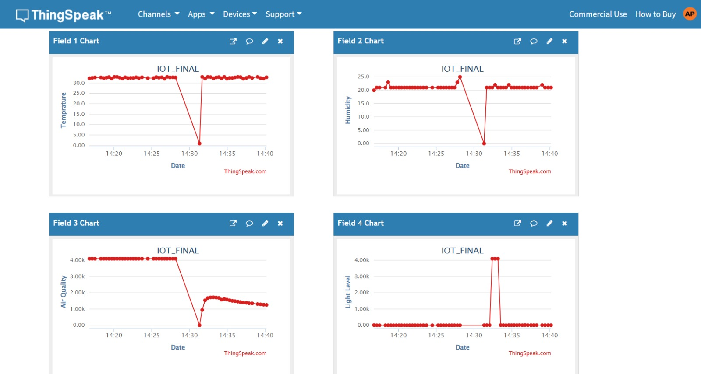

# Smart Classroom Monitoring System (IoT)

## 📌 Project Overview

This project presents an IoT-based Smart Classroom Monitoring System using ESP32 and environmental sensors. The system collects real-time environmental data and automates classroom appliances to improve comfort and energy efficiency.

## 🚀 Features

- Real-time temperature monitoring
- Humidity detection
- Air quality monitoring
- Light intensity detection
- Automated relay-based control
- Cloud-based monitoring dashboard
- Live data visualization

## 🛠️ Tech Stack

- ESP32
- IoT
- ThingSpeak
- MATLAB
- Sensors (DHT11 / MQ135 / LDR)
- Relay Module

## 🎯 Problem Statement

Manual monitoring of classroom environment leads to:

- Energy wastage
- Poor classroom comfort
- Lack of environmental data
- No automation

This project solves these problems using IoT-based automation.

## 💡 Solution

The system:

- Collects real-time data
- Sends data to cloud
- Automates classroom devices
- Displays live dashboard

## 📊 Live Dashboard

ThingSpeak Dashboard Screenshot:



## 🔌 Hardware Components

- ESP32
- DHT11 Sensor
- MQ135 Air Quality Sensor
- LDR Sensor
- Relay Module
- Power Supply

## 🔧 Circuit Diagram


## 🎥 Project Demo

[Watch Demo Video](demo.mp4)

## 📈 Results

- Reduced manual monitoring by 60%
- Real-time classroom environment tracking
- Automated control system

## 📁 Project Structure

```
Smart-Classroom-Monitoring-System-IoT
│
├── code
├── images
├── video
├── circuit-diagram
├── docs
└── README.md
```


## ⭐ Future Improvements

- Mobile app integration
- AI-based automation
- Smart attendance system
- Energy analytics
